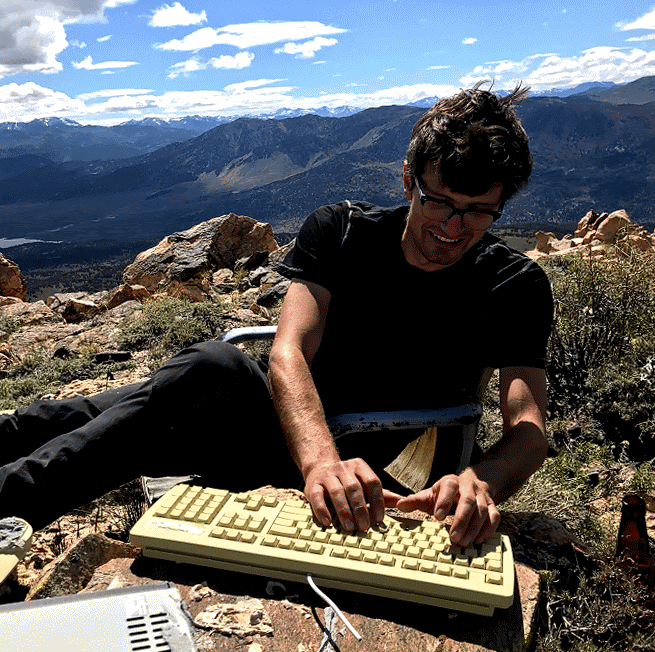

@def title = "Nick Boyd"
@def hasmath = false
@def hascode = false

# Nick Boyd

~~~

  

    
  

  

  

  I did my undergrad at UC Berkeley, where I majored in math and computer science and worked with Dan Klein.
  I stayed for my PhD in statistics advised by Michael Jordan and Ben Recht.
  After a very brief postdoc with Aviv Regev at the Broad Institute, I served as CTO at XGenomes for three years before joining AtomicAI. 
  

  

  I'm generally interested in algorithms for optimization and machine learning and their application to inverse problems in biology, computational imaging, and physics. I also really like <a href="https://julialang.org/">julia</a>.
  

  

~~~

## [Publications](https://scholar.google.com/citations?hl=en&user=4C4GOhYAAAAJ&view_op=list_works&sortby=pubdate)

* [ATOM-1: A Foundation Model for RNA Structure and Function Built on Chemical Mapping Data](https://www.biorxiv.org/content/10.1101/2023.12.13.571579v1), bioRxiv, 2023.
* [Sequencing by Emergence: Modeling and Estimation](https://arxiv.org/abs/2103.10477), arXiv, 2021.
* [Sets as Measures: Optimization and Machine Learning](thesis.pdf), UC Berkeley, 2018.
* [DeepLoco: Fast 3D Localization Microscopy Using Neural Networks](https://www.biorxiv.org/content/10.1101/267096v*full.pdf), bioRxiv, 2018.
* [Saturating Splines and Feature Selection](http://jmlr.csail.mit.edu/papers/volume18/17-178/17-178.pdf), JMLR, 2018.
* [The Alternating Descent Conditional Gradient Method for Sparse Inverse Problems](adcg.pdf), SIAM Journal on Optimization, 2017.
* [Streaming Variational Bayes](SVB.pdf), NeurIPS, 2013.
* [Graph-Theoretic Topological Control of Biological Genetic Networks](topo.pdf) American Control Conference 2009.

<!-- 
## Awards
* 1st place in 2D single-molecule localization microscopy challenge 2016.
* Google Hertz Fellowship.
* 2011 EECS Departmental Citation.
* 2011 Outstanding Academic Achievement Award in L&S CS.
* 2011 Dorothea Klumpke Roberts Prize in Mathematics. -->
