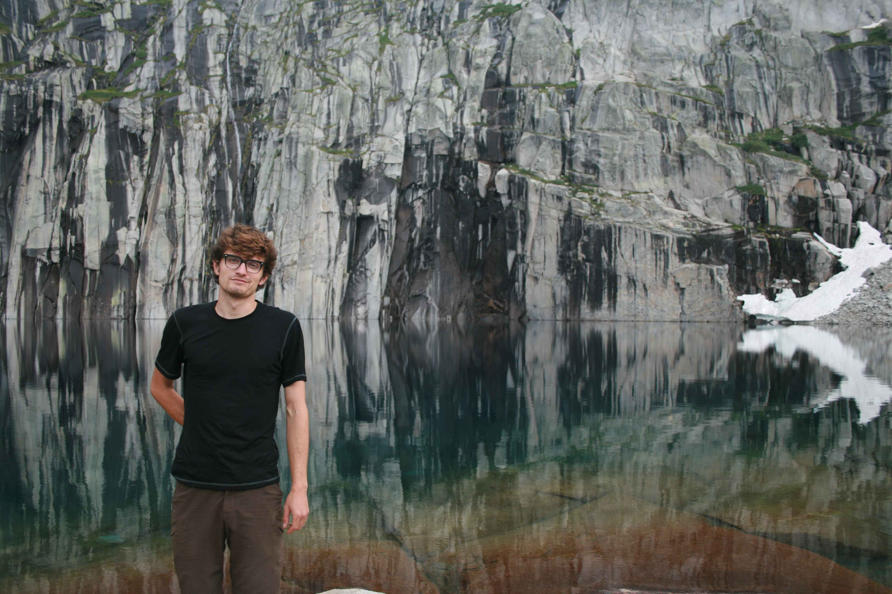

@def title = "Nick Boyd"
@def hasmath = false
@def hascode = false

# Nick Boyd

~~~

  

    

  

  

  

  I do machine learning at a <a href="http://www.xgenomes.com">DNA sequencing startup</a>.
  

  

  I did my undergrad at UC Berkeley majoring in math and computer science and working with Dan Klein.
  I stayed for my PhD in statistics supervised by Michael Jordan and Ben Recht.
  Before joining XGenomes I was briefly a postdoc with Aviv Regev at the Broad Institute.
  

  

  I'm interested in algorithms for optimization, and applications of optimization and machine learning to inverse problems in biology, computational imaging, and physics.
  

  

~~~

## Publications

* Sets as Measures: Optimization and Machine Learning. [pdf](thesis.pdf).
* DeepLoco: Fast 3D Localization Microscopy Using Neural Networks. [pdf](https://www.biorxiv.org/content/10.1101/267096v*full.pdf).
* Saturating Splines and Feature Selection. [pdf](http://jmlr.csail.mit.edu/papers/volume18/17-178/17-178.pdf).
* The Alternating Descent Conditional Gradient Method for Sparse Inverse Problems. [pdf](adcg.pdf).
* Streaming Variational Bayes. [pdf](SVB.pdf).
* Graph-Theoretic Topological Control of Biological Genetic Networks. [pdf](topo.pdf).

See my [google scholar page](https://scholar.google.com/citations?hl=en&user=4C4GOhYAAAAJ&view_op=list_works&sortby=pubdate).

## Awards
* 1st place in 2D single-molecule localization microscopy challenge 2016.
* Google Hertz Fellowship.
* 2011 EECS Departmental Citation.
* 2011 Outstanding Academic Achievement Award in L&S CS.
* 2011 Dorothea Klumpke Roberts Prize in Mathematics.
* 2011 NSF GRFP Honorable Mention.
